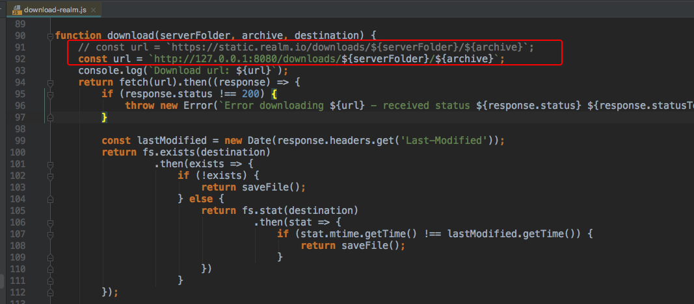

**Why this project**

My aim is to integrate realm into react native project. Durning build process
realm start to download file 'realm-sync-cocoa-3.9.1.tar.gz', which located
in aws s3. The downloading speed is very slow in China. So I write this local
file server to speed up downloading process.

**Usage**

1.copy '_realm-sync-cocoa-3.9.1.tar.gz_' to public folder

'_realm-sync-cocoa-3.9.1.tar.gz_' file size is about 137MB, exceeds GitHub's file size limit
of 100MB, so this file is not included in repo.

you have to download this file yourself from [https://static.realm.io/downloads/sync/realm-sync-cocoa-3.9.1.tar.gz](https://static.realm.io/downloads/sync/realm-sync-cocoa-3.9.1.tar.gz)

2.install dependency

`npm install`

3.start server

`node .`

after server started, visit [http://127.0.0.1:8080/downloads/sync/realm-sync-cocoa-3.9.1.tar.gz](http://127.0.0.1:8080/downloads/sync/realm-sync-cocoa-3.9.1.tar.gz)
in web browser, realm-sync-cocoa-3.9.1.tar.gz should be downloaded.

4.update reaml download url in react-native project

In react-native project, change this line in file '_node_modules/realm/scripts/download-realm.js_':

5.start react-native project

`react-native run-ios`

in console output you can see _realm-sync-cocoa-3.9.1.tar.gz_ will be quickly downloaded from your
local server

**Notice**

_realm-sync-cocoa-3.9.1.tar.gz_ is the current version when I write this project, in
the future realm may update this file's version. I will update this file at that time.

Issue and PR are welcomed!
